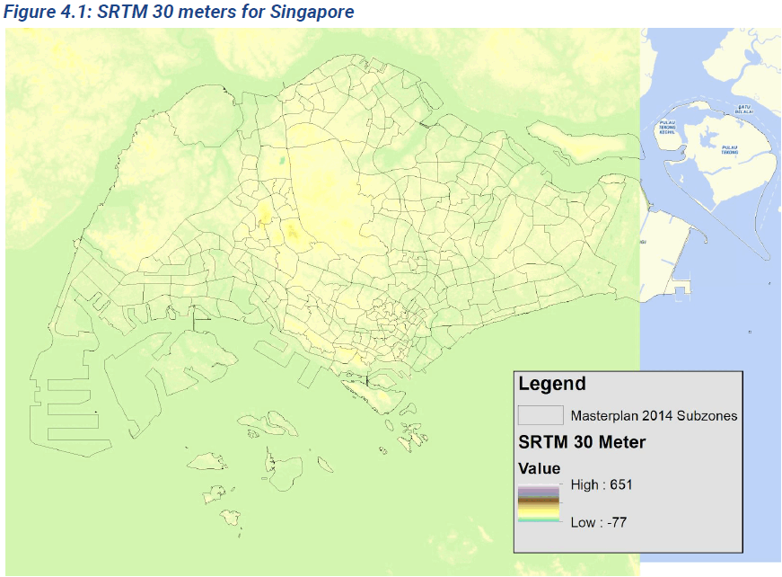

# Undergrad GIS Group Project

For course RE2301: GIS for Real Estate. 
Completed: Year 2018

## Topic: Bikeability in Singapore 
Fun fact: Back then we were seniors taking a lower level module, so we thought why don't we proceed to choose a fun topic that allows us to overkill and demonstrate all the GIS skills we had? :') 

Bikeability was therefore the interesting topic chosen for the aspiring urban planners that we were. 

_Image above generated using DALLE 3_

We wanted to evaluate bikeability throughout Singapore following the work of Van Dyck et al. (2012) and Winters et al. (2012), which created a Bikeability Index that quantifies the factors affecting bikeability. There is an added benefit of allowing comparisions of scores across regions too, which would allow us to formulate practical conclusions regarding infrastructure improvements and policy recommendations to promote cycling in Singapore. 

To build the Index, the following factors were chosen based on existing literatures' methodology and avaliability of data: 

## Technical Data Processing 

1) Converted Digital Elevation Terrain Elevation data to Slope map of Singapore, then aggregated by subzones in Singapore

2) Manually geolocating weather stations in Singapore, then interpolate the Precipitation values to cover whole of Singapore and finally aggregating to subzones

3) Manually geolocating weather stations in Singapore, then interpolate the temperature values to cover whole of Singapore and finally aggregating to subzones

4) Aggregated residential transport modal split, cycling population density, road density, cycling path density, cycling infrastructure density by the subzone level

## Results 

We have some really interesting results (**read the report for the full analysis**), but some of my personal favourites are: 

1) The fact that a steep hill will likely deter any sane folk from wanting to cycle! Slope factor was given the highest weightage as a factor in our index based on a multi-factor regression analysis. 

2) It is therefore not very meaningful to invest heavily in building cycling infrastructure in areas where the slope score is relatively steep such as the Core Central Region:

3) Similarly, other alternatives to cycling needs to be explored in regions where there are higher public proportion to take public transport (hence potentially more willing to switch to cycling) but affected by steep slopes: 

## QY's role in the group project
I mainly handled the raster data processing, maps calculations and visualizations for the project. 

This was done at a time when I did not know how to code, so the most advanced skill I had was to figure out how to do raster processing on ESRI ArcGIS (because in school we were mostly taught how to deal with vector data). 

## Key technical skills
- Raster data processing: Slope calculations from Digital Elevation Terrain Raster data, Zonal Statistics
- Vector data processing: Interpolation (of rainfall and temperature from weather stations in Singapore)

## And Finally...
All good projects are done with the help of awesome-r teammates, so here is a shoutout to my fellow project mates back then @ Amanda Lim, Charis Tan, Ho Yihan and Hu Huidi! 

## References 

- Van Dyck, D., Cerin, E., Conway, T.L., et al. (2012). Perceived Neighborhood Environmental
Attributes Associated with Adults’ Transport-Related Walking and Cycling: Findings
from the USA, Australia and Belgium. International Society of Behavioral Nutrition
and Physical Activity, 9, 70. http://dx.doi.org/10.1186/1479-5868-9-70

- Winters, M., Brauer, M., Setton, E.M. and Teschke, K. (2013). Mapping Bikeability: A Spatial
Tool to Support Sustainable Travel. Environment and Planning B: Planning and Design ,
40, 865-883. http://dx.doi.org/10.1068/b38185
